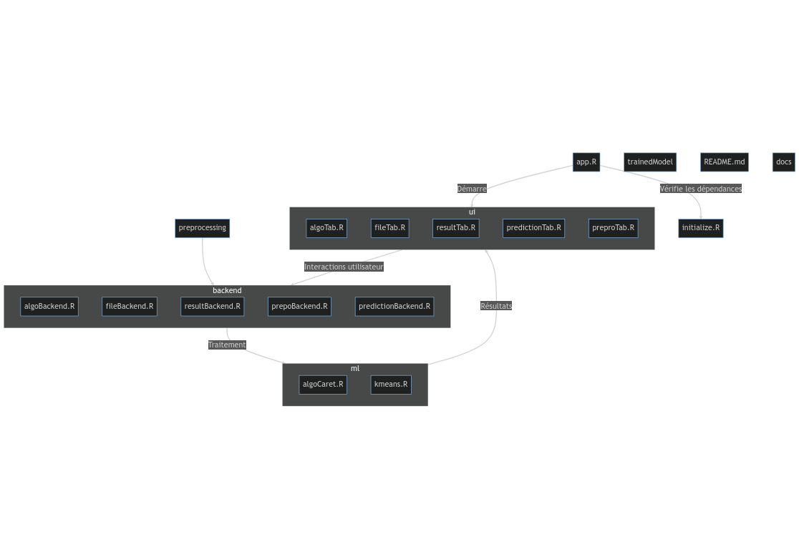
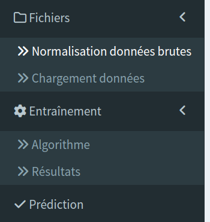

# MLexema

Cette application R permet d'implementer des différents modèles de classification : 
* supervisés -> Random Forest et SVM
* non-supervisés -> Kmeans
\# Neuralnet n'est pas 

## Preparation

Pour accéder aux fichier il faut cloner le répertoire GIT :
```git clone https://github.com/CheburekVlad/MLexema.git```
ou en télechargeant l'archive directement.

### Organisation des fichiers
Voici le schema d'organisation des fichiers:



## Utilisation
L'implémentation de ces modèles se déroule à l'aide d'une application shiny. Pour accéder à l'interface graphique (GUI), il faut executer le code contenu dans app.R ce qui chargera automatiquement les dependances manquants et lancera le GUI.


Une fois l'application lancée, dans le tabboard il existe plusieurs options.
-> Normalisation des données brutes permet d'effectuer le pré-traitement des données pour systematiser le format des fichiers d'entrée de sorte qu'ils puisse être utilisés. Permet également de normalisér les données d'expression et fusionner des datasets differents.

-> Chargement de données permet de soit charger un model de ML existant et analyser le dataset en le chargeant dans l'onglet Prediction, soit de charger un jeu de donner et choisir les variables explicative et la variable cible et de passer à l'etape d'analyse en cliquant sur le bouton soumettre. Dans le deuxieme cas une fois le jeu de données chargé ses 10 premieres lignes seront afficher pour verifier la bonne importation et faciliter le choix des variables.

-> Algorithme est l'onglet sur lequel on peut choisir le type d'analyse.

### RF et SVM
SVM et RF implique l'entrainement d'un nouveau model (bouton Entrainement). La prediction de ce model peut être visualisé en cliquant sur le bouton Analyse du modèle. Ceci va automatiquement ouvrir l'onglet Resultats ou 4 objet peuvent etre consulter pour determiner les resultats d'analyse: Courbe de precision, Predictions du model vs données initiales, Matrice de confusion et la courbe ROC (Cf. graphic_interpretation.md).

### Kmeans
Kmeans, etant un model non-supervisé, ne necessite pas l'entrainement et affiche les resultats directement. Le parametres qui sont donnés par default sont normalement performant pour des petits jeux de données mais peuvent être ajustés si le jeu de données devient plus consequant.

```Nombre de clusters``` permet de choisir le nombre de clusters dans lesquels les observations vont etre divisées.
```Nombre d'essais aleatoires``` permet de choisir combien de fois les centres des clusters seront determiné. La fonction fera ensuite une moyenne pour determiner la separation la plus adequate.
```Nombre d'iterations max``` Permet de choisir le nombre de recalcul des centre des clusters par essai.

Le bouton Clusterisation va directement ouvrir l'onglet Résultats ou 3 objets peuvent être analysés: Prediction de l'algorithme, precision de prediction et la courbe ROC.

## Conlusion

Suite à des données obtenus à la fin d'analyse vous obtenez donc une prediction du phenotype du patient en question. Sachant que la prediction se base UNIQUEMENT sur un model statistique et mathematique le resultat peut varier en fonction de differents parametres (nombre d'oservations, nombre de variables, phase de la Lune ou la presence de l'esprit de votre grand-pere dans la piece etc.) mais également peut étre different d'un essai à l'autre pour les algorythme de ML ces résultats sont en aucun cas des valeurs surs, donc à interpreter avec attention. Pour avoir une meilleure precission il est conseillé d'obtenir la prediction par plusieurs model pour augmenter la probabilité de trouver un resultat juste. 

## Remarques

Fonctionne sous ```R 4.2+```, le bon fonctionnement de l'application n'est pas garanti sous une version inferieure. Dans ce cas il est conseillé d'installer une version plus recente.

Du à des particularité d'utilisation de shiny en cas de probleme il est conseiller de redemarer l'application et votre Session dans R en supprimant les variables de GlobalEnv. Ce détail affecte uniquement les probleme du à l'interface et non la precision de la prediction.


