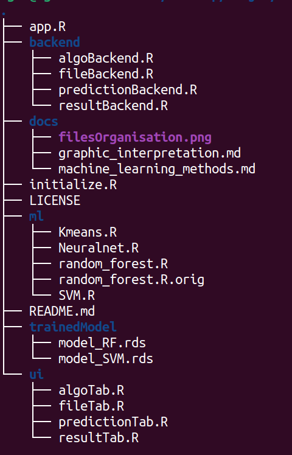

# MLexema

Cette application R permet d'emplementer des differents models de classification : 
-supervisés -> Random Forest et SVM
-non-supervisés -> Kmeans

## Utilisation

Pour acceder aux fichier il faut telecharger le dir par un moyen adequat :
 ```git clone https://github.com/CheburekVlad/MLexema.git```
ou en telechargeant l'archive directement.

L'implementation de ces models se deroule par une application shiny. Pour acceder à l'interface graphique (GUI), il faut executer le code contenu dans app.R ce qui chargera automatiquement les dependances manquants et lancera le GUI.

## Organisation des fichiers
Voici le schema d'organisation des fichiers:




